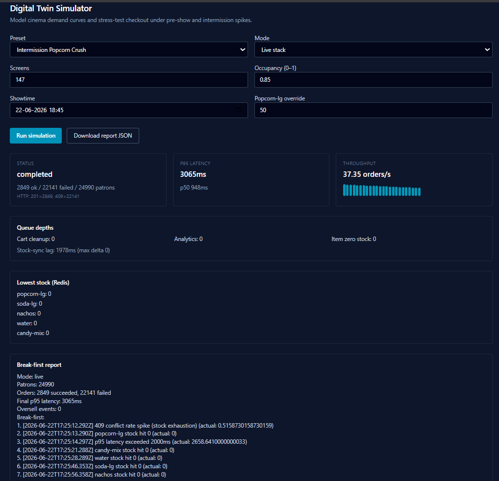

# ApexFlo — Digital Twin Benchmarks

This document explains how to run the digital twin simulator, how to read its output, and how local dev results should be interpreted for submission review.

---

## Purpose

The assignment requires a simulator that:

1. Generates synthetic cinema demand (showtime / intermission spikes)
2. Drives **real APIs** (live mode) or an isolated stub pipeline
3. Reports **queue depth**, **p95 latency**, **oversell events**, and **stock-sync lag**

ApexFlo's digital twin (`apps/digital-twin`, port **3010**) fulfills each requirement. The admin UI surfaces live metrics and a post-run break-first report.

**The primary pass/fail metric for Tier 0 correctness is `oversell events = 0`.** High HTTP 409 counts during a sellout scenario are expected, not failures.

---

## How to reproduce

```bash
bun run start
```

1. Open http://localhost:5173
2. Switch to **Admin** view
3. Log in with `admin@apexflo.local` / `admin123` (or your `.env` values)
4. Open **Digital Twin Simulator**
5. Select a preset (e.g. *Intermission Popcorn Crush*)
6. Click **Run simulation**
7. Watch live metrics; when status is **Completed**, read the **Break-first report**

API alternative: `POST /admin/simulation/run` via gateway with admin JWT (see `apps/digital-twin/src/routes/simulation-routes.ts`).

---

## Preset reference

| Preset | Patrons (approx) | Stock | Run duration | What it tests | Pass criteria |
|--------|------------------|-------|--------------|---------------|---------------|
| **Intermission Popcorn Crush** | ~24,990 (147 screens × 200 seats × 85%) | `popcorn-lg` override = **50** | 25s | Sellout under extreme intermission spike | **Oversell = 0**; 409 spike after stock = 0; WS/async queues healthy |
| **Opening Night** | ~3,600 (16 × 250 × 90%) | Default seed (750–2000 per SKU) | 120s | Dual peaks with adequate inventory | High success rate; lower p95; throughput stable |
| **Matinee Families** | ~660 (8 × 150 × 55%) | Default seed | 60s | Lower load, family-oriented baskets | Baseline sanity check |

Worker concurrency defaults to **500** concurrent HTTP tasks unless overridden in the scenario config.

---

## Metric glossary

| UI field | Meaning | Threshold (break-first) |
|----------|---------|-------------------------|
| **Patrons** | Virtual users generated from venue × occupancy | — |
| **Succeeded (HTTP 201)** | Orders that completed checkout | — |
| **Failed (HTTP 409, etc.)** | Rejected orders (mostly out-of-stock) | — |
| **p50 / p95 latency** | Percentile end-to-end `POST /orders` latency (signup → order in live mode) | p95 > **2000ms** flagged |
| **Throughput (orders/s)** | Successful orders divided by elapsed seconds | — |
| **Queue depths** | BullMQ waiting + active + delayed jobs | Any queue > **500** flagged |
| **Stock-sync lag** | Time since Redis and Postgres `inventory_sql` last matched | > **10000ms** flagged |
| **Lowest stock (Redis)** | Live Redis levels polled each second | Item = 0 triggers stock exhaustion event |
| **Oversell events** | `auditOversell()` — sold quantity exceeded initial stock | **Must be 0** |
| **Break-first report** | Chronological first breach per metric type | Narrative for reviewers |

Constants: `apps/digital-twin/src/static/simulation.constants.ts`

---

## Intermission Popcorn Crush — Local Dev Results



<!-- TODO: Replace the image above with your screenshot after running the simulation.
     Save it as Docs/assets/benchmark-popcorn-crush.png -->

### Sample output (author's local run)

| Metric | Value |
|--------|-------|
| Patrons | 24,990 |
| Succeeded (201) | 2,849 |
| Failed (409) | 22,141 |
| p50 latency | ~948ms |
| p95 latency | ~3,065ms |
| Throughput | ~37 orders/s |
| Stock-sync lag | ~1,978ms |
| Queue depths | 0 (all queues) |
| Oversell events | **0** |
| Redis stock at end | All tracked SKUs at 0 |

### How to read these numbers

**22,141 × HTTP 409 is not a system crash.** The preset seeds only **50 large popcorns** for ~25,000 patrons, many of whom have popcorn in their basket (85% probability for the intermission-rush profile). Once stock hits zero, the order-service correctly returns **409 Conflict** after rolling back partial reservations. This is graceful degradation — patrons are rejected, not oversold.

**2,849 successes** are orders that completed while stock remained across one or more line items (soda, water, candy, nachos, etc.). As the run progresses, all SKUs deplete to zero and failure rate climbs.

**Oversell events: 0** means the atomic Lua decrement path worked: total sold never exceeded initial inventory for any SKU. This is the **Tier 0 hard requirement**.

**Queue depths at 0** means async side-effects (cart cleanup, analytics ingestion, ItemZeroStock fan-out) are not backlog-limited on the hot path. Checkout is decoupled from these workers.

**Stock-sync lag ~2s** is well under the 10s threshold. Write-behind flushes Redis → Postgres every 5s; brief drift is expected and does not affect checkout correctness.

---

## Why p95 latency looks high (~3s) on local dev

The p95 latency breach (> 2000ms) is **real for this environment** but **does not mean the architecture is incorrect**. Factors:

### 1. Single-machine resource contention

`bun run start` launches **10 processes** on one laptop:

- 9 backend microservices (gateway, user, cart, menu, stock, order, analytics, notification, digital-twin)
- Vite dev server (web)
- Digital twin load generator (500 concurrent workers)
- Docker Postgres + Redis

The twin both **generates** and **measures** load on the same CPU cores as the services under test.

### 2. Time compression inflates request rate

The twin maps a ~70-minute real-world ordering window (pre-show + intermission) into a **25-second** run. Patron demand that would be spread over thousands of seconds arrives in a burst, producing artificially high requests/second versus production pacing.

### 3. High concurrent worker count

`workerConcurrency: 500` means up to 500 simultaneous HTTP tasks. On a dev laptop this saturates the event loop and connection pools, inflating tail latency (p95) even when p50 remains under 1s.

### 4. Full synchronous checkout chain per order

Each successful order traverses:

```
Gateway → Order Service → Stock gRPC → Redis Lua
       → Mock payment → Postgres commit → BullMQ publish
```

Each hop adds milliseconds; under contention, tails stack multiplicatively.

### 5. 25k patron signups before orders

Live mode signs up every virtual patron via `POST /auth/signup` (Postgres insert + JWT) before placing orders. Signup burst competes with order traffic on the same machine.

### 6. What `bun run start` improves over `dev:stack`

The one-command bootstrap uses non-watch `start` scripts (no file watcher overhead). For the lowest local latency, run the twin on a **separate machine** pointing `GATEWAY_URL` at the stack — still not production, but removes load-generator contention.

**Bottom line:** p95 on a local dev stack measures **developer hardware saturation**, not the production ceiling. Use *Opening Night* with default stock for a fairer throughput/latency picture.

---

## Why these results are still valid for submission

| Claim | Evidence in local run |
|-------|----------------------|
| **No overselling under concurrency** | Oversell events = 0; Redis integration tests prove Lua serialization |
| **Graceful rejection at stockout** | 22k × 409, not 500 errors |
| **Async paths off hot path** | Queue depths = 0 during run |
| **Bounded stock-sync lag** | ~2s << 10s threshold |
| **Real API exercise** | Live mode uses gateway, order-service, stock gRPC, Postgres |
| **Break-first narrative** | Report shows ordered failure sequence (409 spike → stock 0 → p95 breach) |

The *Intermission Popcorn Crush* preset is a **correctness and sellout** test, not a throughput benchmark. For throughput, run **Opening Night** and compare p95 and success rate.

---

## Rubric alignment

| Rubric area | How benchmarks support it |
|-------------|---------------------------|
| **System design (30%)** | Live mode exercises real service boundaries; queue metrics prove async decoupling |
| **Feature decomposition (25%)** | Presets model distinct audience profiles and peak windows |
| **Load / scale reasoning (20%)** | Break-first report + this doc explain hot-path limits vs Redis single-thread; honest local dev caveats |
| **Digital twin (15%)** | All required metrics reported; oversell audit; presets; live + stub modes |
| **Code quality & tests (10%)** | `auditOversell` in twin; stock Lua integration tests; stub crush unit test |

---

## Recommended runs for reviewers

1. **Intermission Popcorn Crush** — confirm oversell = 0 and 409 spike (5 min)
2. **Opening Night** — observe higher success rate and lower p95 with adequate stock (10 min)
3. **Patron UI** — during crush, confirm menu items disable after `STOCK_ZERO` WebSocket (manual)

---

## Stub mode (optional, faster)

Set scenario `mode: "stub"` in API payload to run the in-process pipeline against Redis DB 15 — no real order-service calls. Useful for CI (`apps/digital-twin/src/test/simulation.test.ts`). Submission demo should use **live** mode.

---

*For architecture context see `Docs/DESIGN_DOCS.md`. For setup see `README.md`.*
