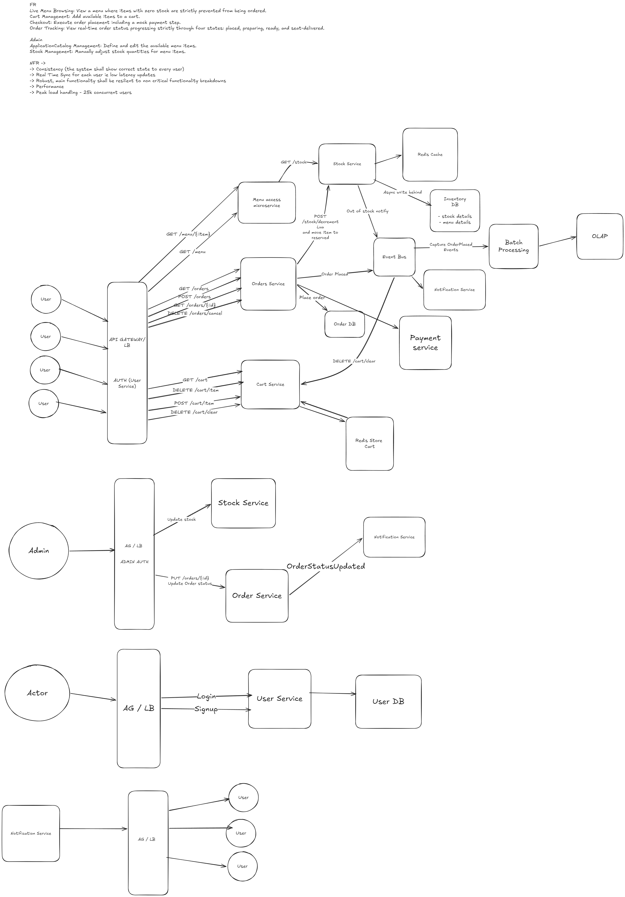

<div align="center">

# ApexFlo: In-Cinema Commerce Platform

**High-Throughput Concurrent Checkout & Telemetry System**


ApexFlo is a high-throughput, event-driven commerce engine designed for the specific physical constraints of an in-cinema environment. It guarantees **zero overselling** and **bounded sync lag** during intense, concentrated traffic spikes (25,000+ concurrent users) at showtime boundaries, while simultaneously streaming structured telemetry to an OLAP datastore for demographic analytics.

[The Problem](#the-problem) •
[The Solution](#the-solution) •
[Architecture](#architecture) •
[System Flow](#system-flow) •
[Services](#service-summary) •
[Failure Handling](#failure-scenarios)

</div>

---

## The Problem

Traditional e-commerce platforms experience relatively uniform traffic distributions. In contrast, cinema commerce generates massive, localized concurrency spikes. At an 8:15 PM showtime or a scheduled intermission, thousands of patrons will simultaneously open the application, view the menu, and attempt to purchase from a strictly limited physical inventory. 

Standard synchronous CRUD architectures fail under this load profile due to:
* **The Read-Modify-Write Trap:** Concurrent checkouts checking relational database rows result in race conditions, leading to physical overselling (selling 500 popcorns when only 1 exists).
* **Thundering Herd Read Contention:** Thousands of patrons refreshing the menu simultaneously lock the database, starving the write-path of connection pools.
* **Synchronous Cascades:** Integrating secondary features (like analytics or notifications) into the checkout hot-path introduces latency. If the analytics database slows down, checkout transactions drop.

## The Solution

ApexFlo decouples the read/write paths and promotes a high-throughput, single-threaded in-memory datastore (Redis) to act as the primary transactional barrier. 

Instead of relying on database row locks, stock decrement logic is isolated within an **atomic Lua script**, guaranteeing sequential processing of concurrent orders in microseconds. The system leverages an **Event Bus** to strip all non-critical operations (out-of-stock notifications, cart clearing, analytics aggregation) completely off the hot path, ensuring the checkout flow remains indestructible.

---

## Architecture

<div align="center">

 *(Insert Excalidraw Export Here)*

</div>

The system is built as a set of decoupled, event-driven services:

```text
Patron Web App
      │
      ▼
┌──────────────┐      ┌─────────────────────┐      ┌─────────────────────┐
│  API Gateway │────▶ │    Menu Service     │────▶ │    Stock Service    │
│  (BFF Layer) │      │  (Read-Optimized)   │      │(Atomic Transactions)│
└──────┬───────┘      └─────────────────────┘      └──────────┬──────────┘
       │                                                      │
       │              ┌─────────────────────┐                 │
       │              │    Order Service    │                 │
       ├────────────▶ │   (Write-Optimized) │─────────────────┤
       │              └──────────┬──────────┘                 │
       │                         │                            │
       │                         ▼                            ▼
       │              ┌───────────────────────────────────────────────┐
       │              │               Event Bus (Kafka)               │
       │              └────┬──────────────────────┬─────────────────┬─┘
       │                   │                      │                 │
       ▼                   ▼                      ▼                 ▼
┌──────────────┐   ┌──────────────┐   ┌──────────────┐   ┌──────────────┐
│ Cart Service │   │ Notification │   │   Analytics  │   │   Payment    │
│ (Redis TTL)  │   │   Service    │   │    Worker    │   │   Gateway    │
└──────────────┘   └──────────────┘   └──────────────┘   └──────────────┘
```

---

## Core Concepts

| Concept | Description |
| :--- | :--- |
| **Atomic Decrement (Lua)** | The absolute concurrency barrier. A Lua script executes inside Redis, evaluating stock levels and decrementing in a single, blocking, atomic step. Completely prevents the oversell bug. |
| **Command Query Responsibility Segregation (CQRS)** | The Menu Service handles reads (Queries) by hitting a Redis Cache. The Order Service handles writes (Commands) via the Stock Service. Reads never block writes. |
| **Write-Behind Caching** | Redis acts as the primary system of record during traffic spikes. A background worker periodically flushes the accurate, resolved state from Redis to the persistent PostgreSQL Inventory DB. |
| **The Hydrated Payload** | The API Gateway pre-fetches the user's cart from the Cart Service and attaches it directly to the checkout payload, eliminating synchronous cross-service communication during the `POST /orders` lifecycle. |

---

## System Flow

### 1. Stock-Aware Browsing (Read Path)
When a patron loads the menu, the request is routed to the `Menu Service`. 
* **Action:** The service fetches static catalog details (names, prices, images) from local cache/DB, and makes an internal `GET` request to the `Stock Service`.
* **Result:** The `Stock Service` returns the exact stock integers directly from Redis memory in microseconds. The `Menu Service` merges this data. Items with `stock <= 0` are disabled in the UI.

### 2. The Checkout Hot-Path (Write Path)
When a patron submits an order, the `API Gateway` fetches the current cart from the `Cart Service` (Redis TTL) and passes the fully hydrated payload to the `Order Service`.
* **Action:** The `Order Service` sends a synchronous `POST /stock/decrement` command to the `Stock Service`.
* **Execution:** The `Stock Service` runs the atomic Lua script. 
    * If stock is insufficient, it aborts, returning a `409 Conflict`.
    * If stock is sufficient, it decrements the value and locks the items as "Reserved".
* **Payment:** The `Order Service` calls the mock Payment Gateway. Upon success, the order is committed to PostgreSQL, and the reservation is permanently consumed.

### 3. Bounded Sync Lag (Out of Stock Propagation)
If the Lua script drops an item's inventory from 1 to 0, immediate system-wide propagation is required.
* **Event:** The `Stock Service` instantly publishes an `ItemZeroStock` event to the Kafka Event Bus.
* **Consumer:** The `Notification Service` consumes this event and blasts a WebSocket message to all active Patron applications.
* **Result:** The UI updates in near real-time, locking out the item before patrons can attempt to add it to their carts.

### 4. Asynchronous Analytics (Tier 1 Implementation)
Business intelligence requires tracking demographic cuts and buying patterns without degrading checkout performance.
* **Event:** Upon successful checkout, the `Order Service` publishes an enriched `OrderPlaced` event (containing user demographics, screen number, showtime, and cart contents) to the Event Bus.
* **Ingestion:** The Analytics Worker pulls these events, buffers them in memory via optimized channels, and executes high-throughput batch inserts into a columnar OLAP database (e.g., ClickHouse).
* **Result:** The Admin dashboard can execute massive `GROUP BY` and `SUM` aggregations over millions of rows without touching the PostgreSQL databases that manage active cinematic operations.

---

## Service Summary

| Service | Protocol | Datastore | Responsibilities |
| :--- | :--- | :--- | :--- |
| **API Gateway / BFF** | HTTP/REST | None | Ingress, authentication routing (JWT validation), cart hydration for checkout payloads. |
| **Stock Service** | gRPC / HTTP | Redis & PostgreSQL | The absolute source of truth for inventory. Executes Lua scripts, manages the Write-Behind worker to persist data to SQL. |
| **Menu Service** | HTTP/REST | Local Cache | Serves the catalog, queries Stock Service for real-time item availability. |
| **Order Service** | gRPC / HTTP | PostgreSQL | Orchestrates the checkout lifecycle: Reserve, Charge, Commit. Publishes events to the bus. |
| **Cart Service** | HTTP/REST | Redis | Manages ephemeral shopping carts with a 3-hour TTL. Subscribes to `OrderPlaced` events to async clear carts. |
| **Notification Service**| WebSockets | None | Maintains active TCP connections to Patron devices, pushing real-time state changes (Stock/Order Status). |

---

## Architectural Decisions & Trade-offs

1.  **Why Redis Lua over SQL Row-Level Locks (`SELECT FOR UPDATE`)?**
    * *Decision:* Under 25,000 concurrent users, traditional relational database connection pools will exhaust, and row-level locks on a highly-contended item (e.g., "Popcorn") will cause massive thread blocking and transaction timeouts. Redis executes Lua scripts sequentially in a single thread, processing tens of thousands of atomic decrements per second completely in-memory, neutralizing the contention bottleneck.
2.  **Why Event-Driven Cart Clearance?**
    * *Decision:* Forcing the `Order Service` to synchronously call `DELETE /cart` after a successful checkout adds a network hop to the critical path. By having the `Cart Service` listen to the `OrderPlaced` Kafka topic, the cart is cleared eventually, allowing the checkout response to return to the user milliseconds faster.
3.  **Analytics Datastore Separation**
    * *Decision:* Analytics queries are read-heavy, wide-column operations. Executing them on the transactional PostgreSQL databases would cause severe index thrashing and CPU spikes. The Analytics Worker safely funnels this data to a dedicated OLAP system.

---

## Failure Scenarios

The system is designed to degrade gracefully:

| Scenario | Behavior |
| :--- | :--- |
| **Analytics Worker Fails** | Kafka retains the `OrderPlaced` events. When the worker restarts, it resumes batch ingestion. Zero impact on revenue or patron checkouts. |
| **Notification Service Drops** | Patrons lose real-time WebSocket updates, but the core checkout flow remains protected by the Stock Service Lua script. Patrons attempting to buy a sold-out item will receive a standard HTTP `409 Conflict` at checkout. |
| **PostgreSQL Inventory DB Drops** | The Write-Behind worker retries with exponential backoff. Because the `Stock Service` treats Redis as the primary hot-path datastore, patrons can continue browsing menus and placing orders uninterrupted. |
| **Payment Gateway Timeout** | The `Order Service` catches the timeout, instructs the `Stock Service` to release the "Reserved" lock back into the available pool, and alerts the patron to try again. |

---

<div align="center">

</div>