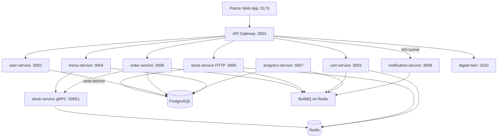
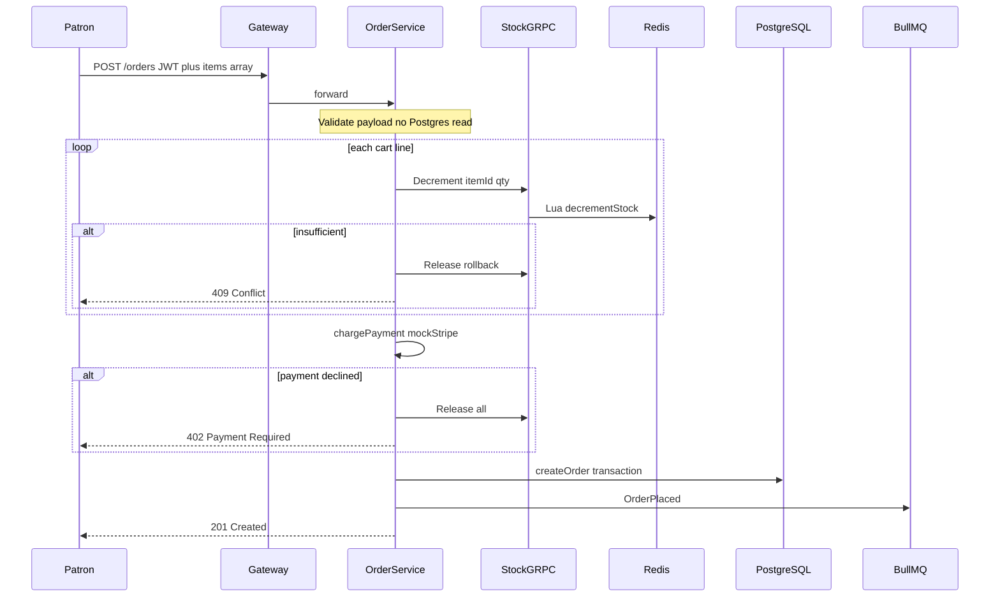
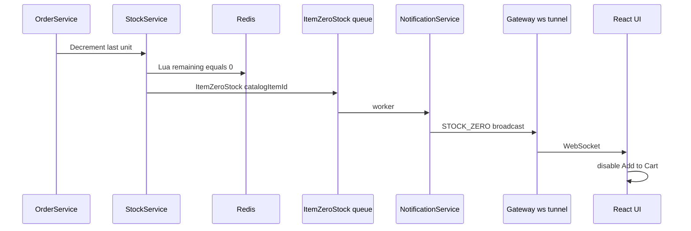

# ApexFlo — Design Document

> **Grader quick start:** Part A (Submission Summary) is the ≤2-page distillation. Part B and the ADR appendix provide full depth for reviewers who want architectural rigor.

---

## Part A — Submission Summary

### Problem

Cinema commerce is not uniformly distributed. At showtime boundaries and intermissions, tens of thousands of patrons open a mobile web app simultaneously and attempt checkout against **physically limited** concession inventory. Standard CRUD architectures fail here: concurrent read-modify-write on relational rows causes **overselling**, thundering-herd reads starve connection pools, and synchronous side-effects (analytics, cart clearing, notifications) bloat the checkout hot path.

ApexFlo targets **Tier 0 (mandatory):** live stock-aware menu, cart, checkout, order tracking, **zero oversell under concurrency**, and **bounded stock-sync lag** to patron devices. **Tier 1 (implemented):** analytics for buying patterns. **Tier 2 (deferred):** offers/promotions.

### Architecture




**Ingress rule:** The gateway is the **only** public entry point. Patrons never call microservices directly. JWT is validated at the gateway and re-validated in each protected service (defense-in-depth).

### Service boundaries

| Service | Port | Owns | Does not touch |
|---------|------|------|----------------|
| **gateway** | 3001 | Routing, JWT, WS proxy | Any datastore |
| **user-service** | 3002 | `users` (Postgres) | Carts, stock, orders |
| **cart-service** | 3003 | `cart:{userId}` (Redis, 3h TTL) | Postgres orders |
| **menu-service** | 3004 | Catalog cache (from Postgres at boot) | Stock writes |
| **stock-service** | 3005 / 50051 | Redis inventory (hot), `inventory_sql` (cold via write-behind) | Orders |
| **order-service** | 3006 | `orders`, `order_items` (Postgres) | Redis carts |
| **analytics-service** | 3007 | `analytics_events` (Postgres) | Checkout hot path |
| **notification-service** | 3008 | In-memory WS clients | Persistent state |
| **digital-twin** | 3010 | Simulation orchestration | Production data (stub mode uses Redis DB 15) |

### Data model (summary)

| Store | Entity | Purpose |
|-------|--------|---------|
| Postgres | `users` | Patron accounts (signup); admin is env-configured |
| Postgres | `catalog_items` | Menu metadata (name, price, image) |
| Postgres | `inventory_sql` | Cold inventory mirror (write-behind from Redis) |
| Postgres | `orders`, `order_items` | Committed orders |
| Postgres | `analytics_events` | Tier-1 event-sourced analytics rows |
| Redis | `stock:available:{itemId}` | Hot-path inventory (Lua decrement target) |
| Redis | `cart:{userId}` | Ephemeral patron carts |

Seed catalog: 7 SKUs (`popcorn-lg`, `popcorn-sm`, `soda-lg`, `nachos`, `hotdog`, `candy-mix`, `water`) with opening stock 300–2000 units (`packages/schema/src/seed-data.ts`).

### 25k-concurrent walkthrough

**Scenario:** A multiplex with 147 screens × 200 seats × 85% occupancy ≈ **24,990 patrons** hit the app during a compressed intermission window (digital-twin preset: *Intermission Popcorn Crush*).

1. **Demand shape:** Patrons are scheduled on Gaussian peaks at pre-show (−8 min from showtime) and intermission (+55 min). The twin compresses a ~70-minute real window into a 25-second run with 500 concurrent HTTP workers — this inflates requests/second versus production pacing but stress-tests contention.

2. **Read path (menu):** Thousands of `GET /menu` calls hit menu-service. Catalog is served from in-memory cache (loaded once from Postgres). Live stock integers are fetched per-request via gRPC `GetStock` from stock-service → Redis. Reads never block writes.

3. **Write path (checkout):** `POST /orders` carries the **full cart array** in the body (gateway does not hydrate). Order-service validates payload, then for each line calls stock-service gRPC `Decrement`. Redis runs an **atomic Lua script** per item — no application-level read-modify-write. On insufficient stock: rollback prior reservations, return **409 Conflict**. On success: mock payment charge → Postgres `createOrder` → publish `OrderPlaced` to BullMQ (cart clear + analytics, async).

4. **Stock exhaustion propagation:** When Lua decrements the last unit to 0, stock-service publishes `ItemZeroStock`. Notification-service consumes and broadcasts `STOCK_ZERO` over WebSocket (via gateway `/ws` tunnel). Patron UI disables "Add to Cart" without refresh. Integration test asserts fan-out **< 50ms**.

5. **Expected bottlenecks:**
   - **Hot SKU (popcorn-lg):** All decrements serialize on Redis's single-threaded Lua execution for that key. This is intentional — correctness over parallel false success.
   - **Stateless services (gateway, order, cart, menu):** Scale horizontally behind a load balancer; linear throughput gain until Redis or Postgres commit rate limits.
   - **Single-laptop dev stack:** 10 Bun processes + Vite + twin load generator on one machine → high P95 latency (see `Docs/BENCHMARKS.md`). This does not invalidate correctness metrics (oversell audit, 409 semantics).

6. **What "25k concurrent" means here:** 25k **virtual patrons** exist in the simulation; 500 **concurrent HTTP workers** drive requests. Production would see 25k open WebSocket/menu sessions with a lower simultaneous checkout RPS — the twin errs on the side of stressing the hot path.

### Tier scope

| Tier | Status | Implementation |
|------|--------|----------------|
| **0 — Ordering + stock** | Complete | Lua decrement, 409 on OOS, WS propagation, cart, checkout, order tracking |
| **1 — Analytics** | Complete | `OrderPlaced` → analytics-service batcher → `analytics_events` |
| **2 — Offers/promotions** | Out of scope | Documented as future work |

---

## Part B — Full Architecture Reference

### Assumptions

- Single cinema venue, single region, single currency (USD cents).
- Patrons order from their seat via mobile web; no native app.
- Payment is mocked (`mockStripe`); simulation uses a zero-latency bypass header.
- Admin manages stock via REST; patrons cannot adjust inventory.
- One showtime model: patrons provide `showtime` ISO string at checkout for analytics context.
- Intermission timing is deterministic per simulation preset (default +55 min from showtime).
- Shared `JWT_SECRET` across all services (same deployment trust domain).
- Redis and Postgres are highly available in production; local dev uses Docker Compose.
- BullMQ (Redis-backed) is the event bus — not Kafka, for operational simplicity at this scale.

### Questions for a PM

1. When an item hits zero stock mid-checkout (patron already has it in cart), is 409 at submit acceptable, or should we hold soft reservations in-cart?
2. What is the SLO for stock-sync lag to patron devices (we target < 10s Postgres drift, < 50ms WS fan-out)?
3. Should admin analytics be real-time or batch-delayed (currently 5s batch interval)?
4. Is seat delivery status workflow in scope for v1 (admin can transition order status; patron sees WS updates)?
5. Multi-venue inventory isolation — separate Redis keyspaces per site?
6. Refund/cancel policy: cancel restores stock synchronously via gRPC `Release` (implemented).

### Out of scope

- Offers, promotions, conflict resolution between overlapping deals (Tier 2).
- Real payment processor integration (Stripe live mode).
- Multi-venue / franchise routing.
- Kubernetes deployment manifests (documented scale-out path only).
- k6 load-test scripts (digital twin covers rubric requirement).
- Pixel-perfect mobile UI (functional React + Tailwind only).

---

### Microservice justification

Each capability is an **independently deployable process** with its own port and `package.json`. Shared code lives only in `packages/*` (`schema`, `core`, `event-bus`, `rpc`). No service imports another service's `src/`.

| Service | Why separate (not a module) |
|---------|---------------------------|
| **stock-service** | Owns Redis hot path + Lua; must scale and fail independently; gRPC contract for sub-ms internal calls |
| **order-service** | Owns Postgres orders; checkout orchestration isolated from inventory mechanics |
| **cart-service** | Owns Redis carts; consumes `OrderPlaced` async — different scaling profile than orders |
| **menu-service** | Read-optimized; cache-heavy; no write contention with checkout |
| **user-service** | Owns identity; JWT issuance; patron vs admin auth |
| **analytics-service** | Write-heavy batch ingestion; must never slow checkout |
| **notification-service** | Long-lived WebSocket connections; different process model than request/response |
| **gateway** | Single public ingress; TLS termination point; hides internal topology |
| **digital-twin** | Test harness; not deployed to production patron path |

---

### Sync vs async paths

**Synchronous (checkout hot path):**

```
Patron → Gateway → Order Service → Stock gRPC → Redis Lua
                → Payment mock → Postgres commit → 201 response
```

**Asynchronous (off hot path):**

| Event | Publisher | Consumer | Effect |
|-------|-----------|----------|--------|
| `OrderPlaced` | order-service | cart-service | Delete `cart:{userId}` |
| `OrderPlaced` | order-service | analytics-service | Buffer → batch insert `analytics_events` |
| `ItemZeroStock` | stock-service | notification-service | WS `STOCK_ZERO` broadcast |
| `OrderStatusUpdated` | order-service | notification-service | WS `ORDER_STATUS_UPDATED` to order owner |

Queue names: `CartCleanupQueue`, `AnalyticsQueue`; `ItemZeroStock` uses event name as queue name (`packages/event-bus/src/queues.constants.ts`).

---

### Read path — stock-aware menu

1. `GET /menu` → gateway → menu-service.
2. Menu-service returns catalog from in-memory array (hydrated from Postgres at process start).
3. For each item, menu-service calls stock-service gRPC `GetStock` → reads `stock:available:{itemId}` from Redis.
4. Items with `stock <= 0` are flagged; patron UI disables "Add to Cart".
5. On `STOCK_ZERO` WebSocket message, `CinemaSocketContext` adds item to `zeroStockIds` set — no page refresh.

**CQRS implication:** Menu reads never acquire locks on inventory. Stock writes never touch the catalog tables.

---

### Write path — checkout hot path



**Rules enforced in code:**

- No Postgres query on hot path before payment succeeds.
- Full cart in request body — patron web sends `items[]` from `CartContext`.
- Partial reservation rollback on any line failure.
- `x-apexflo-simulation: twin` header switches to zero-latency mock payment for digital twin runs.

---

### Stock and concurrency

**Lua scripts** (`apps/stock-service/src/lua/`):

- `decrement-stock.lua` — atomic GET → check → DECRBY; returns `{code, remaining}` where code `1` = success, `0` = insufficient, `-1` = key missing.
- `release-stock.lua` — INCRBY on existing key; returns `-1` if key missing (no accidental stock creation).

Registered via `defineCommand` in `stock-service.ts` as `decrementStock` and `releaseStock`.

**Why not SQL `SELECT FOR UPDATE`?** Under thousands of concurrent checkouts on one SKU (popcorn), row-level locks cause connection pool exhaustion and thread blocking. Redis executes Lua atomically on a single thread — tens of thousands of decrements/sec in-memory.

**Write-behind worker** (`apps/stock-service/src/workers/write-behind.worker.ts`):

- Interval: 5 seconds.
- SCAN `stock:available:*` → MGET → upsert `inventory_sql` in Postgres.
- Overlapping flushes skipped; failures logged and retried next tick.
- **Postgres outage does not block checkout** — Redis remains source of truth during spikes.

**Separate Redis connections:** Hot-path gRPC/HTTP uses one connection; write-behind SCAN uses another to avoid blocking decrements.

---

### WebSocket — bounded sync lag



- Gateway proxies `GET /ws` → `notification-service:3008/ws` (native fetch/WebSocket tunnel for Bun compatibility).
- BullMQ worker `drainDelay: 1` minimizes queue wait.
- Test: `apps/notification-service/src/test/websocket-integration.test.ts` — fan-out < 50ms.

**Stock-sync lag (twin metric):** Measures Redis vs Postgres `inventory_sql` drift time. Write-behind interval is 5s; twin flags lag > 10s. Local runs typically show ~2s — within threshold.

---

### Analytics tier (Tier 1)

- **Publish:** After successful `createOrder`, order-service enqueues `OrderPlaced` with demographics (`ageGroup`), screen, seat, showtime, line items.
- **Consume:** analytics-service worker pulls from `AnalyticsQueue`.
- **Batch:** In-memory buffer flushes every **5s** or **1000 events** (`analytics-batcher.ts`).
- **Persist:** `bulkInsert` into `analytics_events` (JSONB payload, indexed by `event_type`, `showtime`).
- **No query API in v1** — service is ingestion-only + `/health`.

**Rationale:** Analytics is read-heavy and wide-column. Keeping it out of checkout and out of transactional Postgres tables prevents index thrashing on the order path.

---

### Digital twin

**Purpose:** Rubric-required simulator — synthetic demand, drives real APIs, reports queue depth, p95 latency, oversell events, stock-sync lag.

| Mode | Behavior |
|------|----------|
| **live** | Signs up patrons via gateway, places real `POST /orders` with simulation header; requires admin token for stock refill |
| **stub** | In-process pipeline mirroring order-controller logic; Redis DB **15** isolated |

**Presets** (`apps/digital-twin/src/static/presets.ts`):

- *Intermission Popcorn Crush* — ~25k patrons, 50 popcorn-lg, sellout test.
- *Opening Night* — 16 screens, default stock, 120s run, dual peaks.
- *Matinee Families* — lower occupancy, family baskets.

**Metrics audited:** `auditOversell()` compares sold quantities vs initial stock; break-first report flags threshold breaches (p95 > 2s, conflict rate > 30%, stock exhaustion, queue depth > 500).

See `Docs/BENCHMARKS.md` for interpretation guide.

---

### Security

- **JWT:** Issued by user-service on signup/login; verified by gateway (`registerJwt` from `@commerical-cinema/core`) and again in each protected service.
- **Roles:** `patron` (cart, orders) vs `admin` (stock, simulation, all orders, status transitions).
- **Admin credentials:** Env vars `ADMIN_EMAIL` / `ADMIN_PASSWORD` — not stored in Postgres (simplifies evaluator setup).
- **Simulation header:** `x-apexflo-simulation: twin` — bypasses real payment latency only; still exercises stock + order path.

---

### Gateway BFF decisions

- **Native `fetch` proxy** instead of `http-proxy` — Bun compatibility (`apps/gateway/src/index.ts`).
- **No cart hydration on checkout** — patron sends full cart; avoids synchronous gateway → cart-service call on hot path.
- **WebSocket tunnel** — patrons connect to gateway `/ws`; gateway maintains upstream to notification-service.
- **Route table:** `/auth/*` → user; `/menu` public; `/cart/*` patron; `/orders/*` patron; `/admin/*` admin; `/stock/refill` admin; `/admin/simulation/*` → digital-twin.

---

### gRPC vs HTTP for stock

| Surface | Protocol | Use case |
|---------|----------|----------|
| Internal hot path | gRPC `:50051` | `Decrement`, `Release`, `GetStock` from order-service and menu-service |
| Admin / gateway | HTTP `:3005` | Stock refill, per-item PUT, health checks |

gRPC chosen for typed, low-overhead internal calls on the contention-critical inventory path. Admin operations are low-frequency HTTP REST.

---

### Failure scenarios

| Scenario | Behavior |
|----------|----------|
| **Analytics worker down** | BullMQ retains jobs; checkout unaffected; events replay on restart |
| **Notification service down** | No live WS updates; checkout still protected by Lua; patron gets 409 at submit for sold-out items |
| **Postgres inventory DB down** | Write-behind retries; Redis serves checkout; menu catalog already cached |
| **Postgres orders DB down** | Checkout fails at commit after payment — stock released on error path |
| **Payment timeout** | Order-service releases reservations; patron retries |
| **Redis down** | Stock decrements fail; checkout returns 5xx/409; no oversell possible |
| **Queue backlog** | Twin reports depth; cart cleanup delayed but checkout already returned 201 |
| **Partial multi-line failure** | `releaseAll()` rolls back prior decrements before 409 |

---

### Testing strategy

| Test | Proves |
|------|--------|
| `stock-service/src/test/redis-integration.test.ts` | 5 concurrent buyers vs 1 stock → exactly 1 success; 500 vs 100 → exactly 100 sold |
| `order-service/src/controllers/order-controller.test.ts` | Reserve → charge → commit; 409 rollback; 402 payment fail; cancel restores stock |
| `notification-service/src/test/websocket-integration.test.ts` | ItemZeroStock → STOCK_ZERO < 50ms |
| `analytics-service/src/workers/analytics-batcher.test.ts` | Batch coalescing + bulkInsert |
| `digital-twin/src/test/simulation.test.ts` | Stub crush — conflicts without oversell |
| `web/src/components/patron/MenuGrid.test.tsx` | Add to Cart disabled on STOCK_ZERO |

Run: `bun run test`

---

### Local dev and operations

| Command | Purpose |
|---------|---------|
| `bun run start` | **Evaluator one-command** — Docker, migrate, seed, all services + web |
| `bun run dev:stack` | Backend watch mode (development) |
| `bun run dev:web` | Vite frontend (development) |
| `bun run db:up` / `db:down` | Postgres + Redis containers only |
| `bun run test` | Full test suite |

Ports: gateway 3001, web 5173, Postgres 5433, Redis 6379. See `README.md`.

---

### Known limits and scale-out path

| Layer | Limit on local dev | Scale-out approach |
|-------|-------------------|-------------------|
| Gateway, order, cart, menu, user | CPU-bound on one machine | Horizontal replicas + load balancer |
| stock-service | gRPC pool to shared Redis | Multiple replicas; Redis still serializes per key |
| Redis | Single-threaded Lua per hot SKU | Redis Cluster shards by key; hot SKU remains serial |
| notification-service | In-memory WS map per instance | Sticky sessions or Redis pub/sub bridge |
| Postgres | Order commit rate | Read replicas for analytics only; orders stay primary |
| Digital twin | Load gen on same host as stack | Run twin on separate machine for accurate latency |

---

## ADR Appendix

### ADR-001: Redis Lua over SQL row locks

- **Context:** Thousands of concurrent checkouts on one SKU.
- **Decision:** Atomic Lua scripts in Redis for decrement/release.
- **Consequences:** Zero oversell; hot SKU serializes in Redis thread; Postgres not on hot path.

### ADR-002: BullMQ over synchronous HTTP for cart clear

- **Context:** Cart must clear after order; sync call adds latency to checkout response.
- **Decision:** Publish `OrderPlaced`; cart-service consumes async.
- **Consequences:** Cart may briefly persist after 201; checkout is faster; eventual consistency acceptable.

### ADR-003: Postgres not on checkout hot path

- **Context:** Relational reads under burst traffic exhaust pools.
- **Decision:** Validate payload in memory; Postgres write only after payment success.
- **Consequences:** Cannot detect duplicate order IDs from DB before charge; payment mock is idempotent enough for demo.

### ADR-004: gRPC for stock decrement

- **Context:** Order-service needs lowest-latency internal inventory calls.
- **Decision:** gRPC on port 50051 for Decrement/Release/GetStock.
- **Consequences:** Proto contract in `packages/rpc`; HTTP stock API for admin only.

### ADR-005: Write-behind inventory sync

- **Context:** Postgres writes too slow for spike; but analytics/admin need cold copy.
- **Decision:** 5s SCAN/MGET/upsert worker from Redis → `inventory_sql`.
- **Consequences:** Bounded drift; twin measures lag; checkout unaffected by PG slowness.

### ADR-006: Full cart in POST /orders body

- **Context:** Gateway could hydrate cart from cart-service synchronously.
- **Decision:** Patron web sends complete `items[]` at checkout.
- **Consequences:** One fewer network hop; client responsible for cart accuracy; matches rubric frontend rule.

### ADR-007: Admin credentials via environment

- **Context:** Evaluators need instant admin access without seed complexity.
- **Decision:** `ADMIN_EMAIL` / `ADMIN_PASSWORD` env vars; constant-time compare in auth-controller.
- **Consequences:** No admin row in Postgres; rotation requires redeploy.

### ADR-008: Digital twin stub Redis DB 15

- **Context:** Stub mode must not corrupt production Redis keys.
- **Decision:** `STUB_REDIS_DB = 15` for isolated stub stock.
- **Consequences:** Same Lua scripts copied to stub; live mode uses real stack.

### ADR-009: Gateway as sole public ingress

- **Context:** Microservices must not be exposed individually.
- **Decision:** All patron/admin HTTP through gateway :3001; WS tunneled.
- **Consequences:** Single TLS termination point; internal URLs are localhost in dev.

### ADR-010: JWT defense-in-depth

- **Context:** Compromised internal network could bypass gateway.
- **Decision:** Every protected service re-verifies JWT with shared `JWT_SECRET`.
- **Consequences:** Slight CPU overhead; stronger boundary enforcement.

### ADR-011: Native fetch proxy in gateway

- **Context:** `http-proxy` compatibility issues with Bun.
- **Decision:** Manual `fetch` forwarding for HTTP; WebSocket pipe for `/ws`.
- **Consequences:** Explicit header forwarding; no streaming upload edge cases yet.

### ADR-012: Menu catalog in-memory cache

- **Context:** Catalog rarely changes during a show; menu reads are extremely frequent.
- **Decision:** Load `catalog_items` once at menu-service boot.
- **Consequences:** Admin catalog changes require service restart; acceptable for v1.

### ADR-013: Separate Redis connections for hot path vs write-behind

- **Context:** SCAN in write-behind can block shared connection.
- **Decision:** Dedicated ioredis instances per concern in stock-service.
- **Consequences:** More connections; hot path isolation.

### ADR-014: BullMQ `maxRetriesPerRequest: null`

- **Context:** BullMQ workers use blocking Redis commands.
- **Decision:** Separate bus connection with blocking-safe settings (`packages/event-bus/src/connection.ts`).
- **Consequences:** Cannot reuse generic Redis client for queues.

### ADR-015: Mock payment with simulation bypass

- **Context:** Real Stripe adds latency variance; twin needs deterministic runs.
- **Decision:** `mockStripe` default; `chargeSimulationPayment` when simulation header present.
- **Consequences:** Payment failure paths tested separately; no PCI scope.

### ADR-016: Order status via admin + WS notification

- **Context:** Patrons track concession delivery to seat.
- **Decision:** Admin PATCH status; `OrderStatusUpdated` event → WS to owning patron only.
- **Consequences:** No patron-initiated status changes beyond cancel.

### ADR-017: Cancel restores stock synchronously

- **Context:** Cancelled orders should return inventory.
- **Decision:** gRPC `Release` per line on eligible cancel.
- **Consequences:** Extra gRPC calls; correct inventory restoration.

### ADR-018: Analytics batch insert (5s / 1000 events)

- **Context:** Per-order Postgres insert would rival checkout write load.
- **Decision:** In-memory buffer with dual flush triggers.
- **Consequences:** Up to 5s analytics delay; acceptable for Tier 1 dashboard future.

### ADR-019: Monorepo workspaces with strict import boundaries

- **Context:** Prevent modular monolith creep.
- **Decision:** `apps/*` + `packages/*`; no cross-service `src` imports.
- **Consequences:** Shared types in `schema`; infra in `core`; events in `event-bus`.

### ADR-020: MVC layering within each service

- **Context:** Consistent code navigation and testability.
- **Decision:** Routes → Controllers (validation + orchestration) → Services (data only); constants in `static/`.
- **Consequences:** Verbose file count; clear separation for reviewers.

### ADR-021: Patron signup creates JWT session

- **Context:** Carts and orders are user-scoped.
- **Decision:** `POST /auth/signup` creates user row + returns JWT; twin generates unique patrons per run.
- **Consequences:** 25k signup burst in simulation stresses user-service — realistic for opening night.

### ADR-022: Fire-and-forget event publish after commit

- **Context:** Queue failure after successful order should not fail the patron response.
- **Decision:** Log queue errors; 201 already sent.
- **Consequences:** Rare cart-not-cleared if queue down; BullMQ durability mitigates.

---

*Document version: submission build. For benchmark interpretation see `Docs/BENCHMARKS.md`. For run instructions see `README.md`.*
